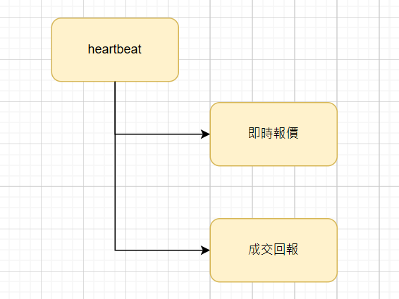

# Demo 網格交易系統 Side Project

> 此為Demo 用 網格交易系統 Side Project，已刪除下單相關程式碼

### 系統架構

目前架構
- 伺服器: AWS EC2 Ubuntu 24.04
- 資料庫: PostgreSQL
- 前端: React

背景程序
- 是使用 Goroutine 實作
- heartbeat: 確保 即時報價(Goroutine) 和 成交回報(Goroutine) 能斷線重啟
- 即時報價: 呼叫幣安 即時報價 WebSocket API，更新即時報價，並且傳送到自己的websocket 供前端(React)接收即時顯示 
- 成交回報: 呼叫幣安 成交回報 WebSocket API，更新成交回報

Todo: 
- 之後想把這些改成獨立線程，包在 Docker 裡面，用 ```--restart=always``` 處理 
- 因為未來還有 背景下單service 和 庫存再平衡 service 要處理


Goroutine 背景處理架構大概長這樣



